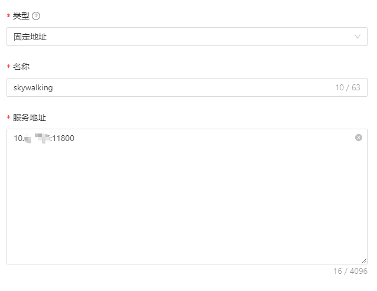
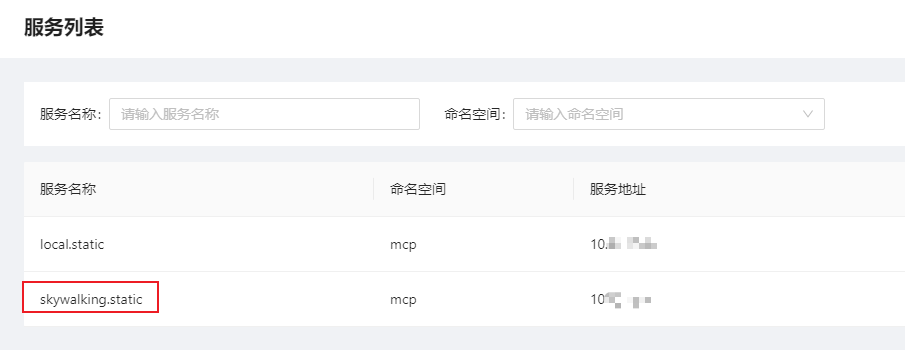
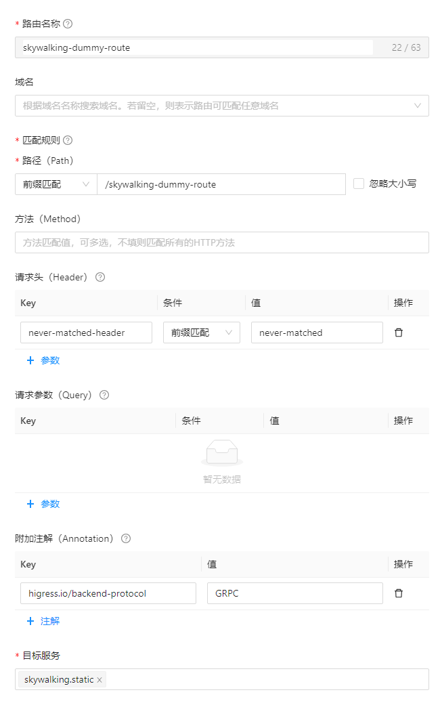
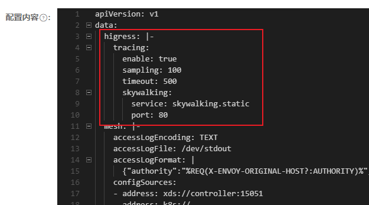

# 非 K8s 部署下对接 Skywalking

## 配置 Skywalking 服务

### 配置服务来源

1. 打开 Higress Console
2. 进入“服务来源”页面
3. 点击“创建服务来源”按钮
4. 如果使用 IP 连接 Skywalking 服务
   1. 类型选择“固定地址”
   2. 根据提示填入服务地址，端口需要使用 Skywalking 服务的 gRPC 端口，默认为 11800
3. 如果使用域名或者主机名连接 Skywalking 服务
   1. 类型选择“DNS域名”
   2. 端口填入 Skywalking 服务的 gRPC 端口，默认为 11800
   3. 域名列表填入 Skywalking 服务的域名或主机名
4. 点击“保存”
5. 进入“服务列表”页面，记录新增的 Skywalking 服务名称（类似 xxx.static 或 xxx.dns）

配置示例：





### 配置占位路由

注：本步骤仅在 https://github.com/alibaba/higress/issues/1316 解决前需要执行。

1. 打开 Higress Console
2. 进入“路由配置”页面
3. 点击“创建路由”按钮
4. 按照以下配置填写路由表单：
    - 名称任意，可以考虑使用类似“skywalking-dummy-route”之类的名称
    - 域名留空
    - 匹配规则任意，可以考虑使用“前缀匹配 + /skywalking-dummy-route”的配置
    - 请求头设置一个绝对不会匹配到的规则，例如：“never-matched-header: nevery-matched”
    - 附加注解添加“higress.io/backend-protocol: GRPC”
    - 服务选择之前配置的 Skywalking 服务
4. 点击“保存”

配置示例：



## 启用 Higress Skywalking 功能

注：此处基于 Nacos 配置方式进行讲解。如果使用其他配置方式，请自行领悟~

1. 打开 Nacos 控制台
2. 进入"配置管理"→“配置列表”，选择 higress-system 命名空间
3. 编辑 Data Id 为 configmaps.higress-config 的配置
4. 在“data:”节点下添加以下配置：
    ```yaml
    data:
    higress: |-
        tracing:
        enable: true
        sampling: 100
        timeout: 500
        skywalking:
          service: {前面记录下来的 Skywalking 服务名称}
          port: {如果你用的是固定类型的服务来源，这里统一填 80。如果用的是 DNS 域名类型的服务来源，这里填配置服务来源时填写的服务端口。}
    ```
    
5. 发布配置

## 配置完成